# Kitions Platform - Comprehensive Codebase Analysis

## Executive Summary

The Kitions platform is a sophisticated multi-application ecosystem designed to connect distributors and retailers in a B2B marketplace. The platform consists of three distinct Next.js applications working together to provide a complete business solution, supported by a robust Supabase backend with comprehensive authentication, authorization, and data management systems.

## Table of Contents

1. [System Architecture Overview](#system-architecture-overview)
2. [Application Portfolio](#application-portfolio)
3. [Technical Stack Analysis](#technical-stack-analysis)
4. [Database Architecture](#database-architecture)
5. [Authentication & Authorization](#authentication--authorization)
6. [Business Logic Analysis](#business-logic-analysis)
7. [Security Implementation](#security-implementation)
8. [Development Practices](#development-practices)
9. [Performance Considerations](#performance-considerations)
10. [Scalability Assessment](#scalability-assessment)
11. [Recommendations](#recommendations)

## System Architecture Overview

The Kitions platform follows a **microservices-inspired architecture** with three specialized applications, each serving distinct user groups and business functions:

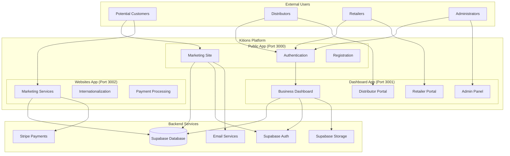

### Architecture Principles

1. **Separation of Concerns**: Each application has a distinct purpose and user base
2. **Shared Authentication**: Cross-domain cookie-based authentication system
3. **Centralized Data**: Single Supabase instance serves all applications
4. **Role-Based Access**: Comprehensive RBAC system with middleware enforcement
5. **Scalable Design**: Independent deployment and scaling capabilities

## Application Portfolio

### 1. Public App (`public-app/`)

**Purpose**: Customer acquisition, authentication, and initial user onboarding

**Key Features**:
- Marketing landing pages
- User registration and authentication
- Email verification system
- Partnership and distributor information
- Blog and content management

**Target Users**: Prospective customers, new users

**Technology Highlights**:
- Next.js 15.3.1 with App Router
- Mapbox integration for address autocomplete
- Resend for email services
- FontAwesome icons
- Framer Motion animations

### 2. Dashboard App (`dashboard-app/`)

**Purpose**: Core business operations platform for verified users

**Key Features**:
- Role-based dashboards (Distributor, Retailer, Admin)
- Product and inventory management
- Order processing and tracking
- User verification system
- Barcode generation and scanning
- File upload and storage management
- Comprehensive admin panel

**Target Users**: Verified distributors, retailers, platform administrators

**Technology Highlights**:
- Next.js 15.3.1 with App Router
- Barcode generation (`jsbarcode`) and scanning (`@zxing/library`)
- Advanced middleware for authentication and authorization
- Supabase storage integration
- Real-time data updates

### 3. Websites App (`websites-app/`)

**Purpose**: Marketing services and payment processing

**Key Features**:
- Internationalization (English/Spanish)
- Stripe payment integration
- Service pricing and plans
- Portfolio showcase
- Contact and support forms

**Target Users**: Marketing prospects, service customers

**Technology Highlights**:
- Next.js 15.3.1 with App Router
- Next-intl for internationalization
- Stripe payment processing
- Multi-language content management

## Technical Stack Analysis

### Frontend Technologies

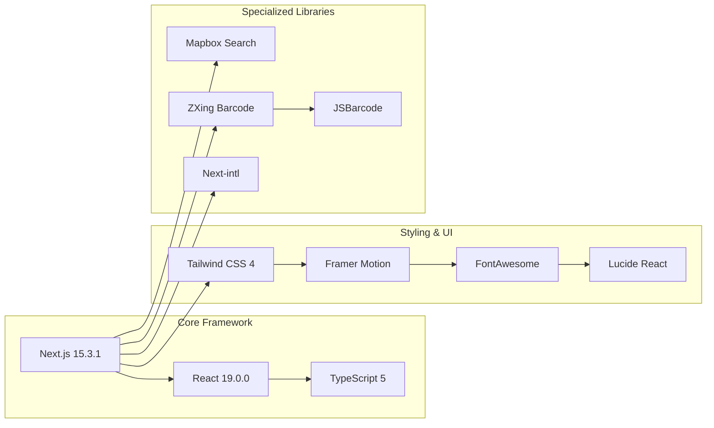

### Backend & Infrastructure

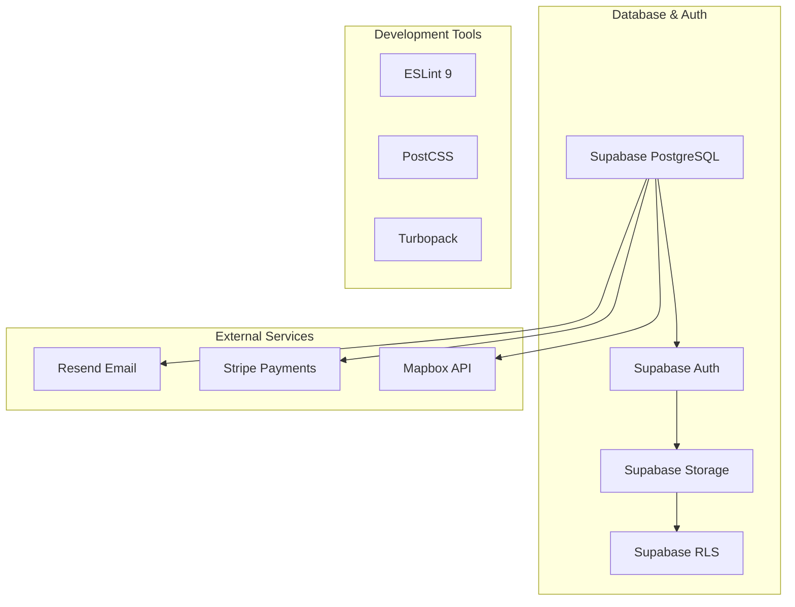

### Key Technical Decisions

1. **Next.js 15.3.1**: Latest stable version with App Router for optimal performance
2. **React 19**: Cutting-edge React features for enhanced user experience
3. **TypeScript**: Full type safety across all applications
4. **Tailwind CSS 4**: Utility-first CSS framework for rapid development
5. **Supabase**: Comprehensive backend-as-a-service for rapid development
6. **Turbopack**: Fast development builds and hot reloading

## Database Architecture

### Entity Relationship Diagram

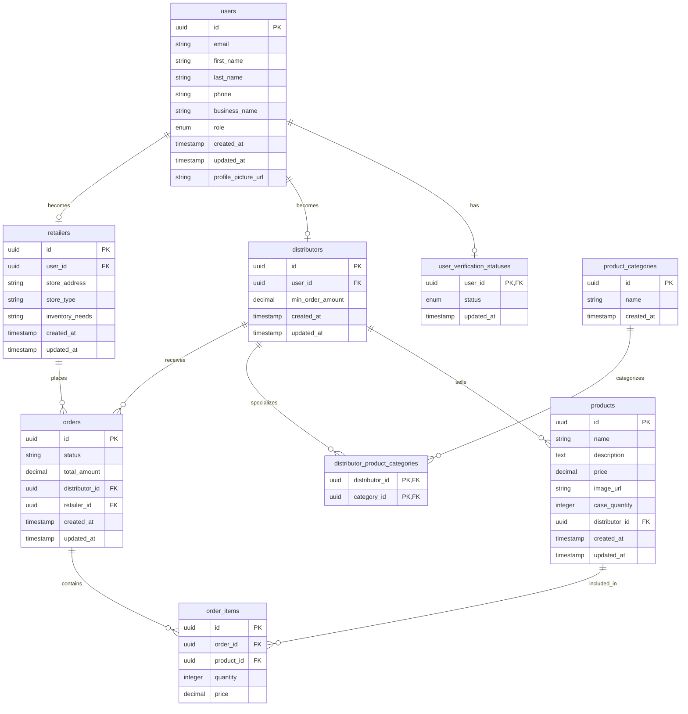

### Database Design Principles

1. **Normalized Structure**: Proper normalization to reduce redundancy
2. **UUID Primary Keys**: Globally unique identifiers for distributed systems
3. **Audit Trails**: Created/updated timestamps on all entities
4. **Flexible Relationships**: Support for many-to-many relationships
5. **Role-Based Data**: Separate tables for different user types

## Authentication & Authorization

### Authentication Flow

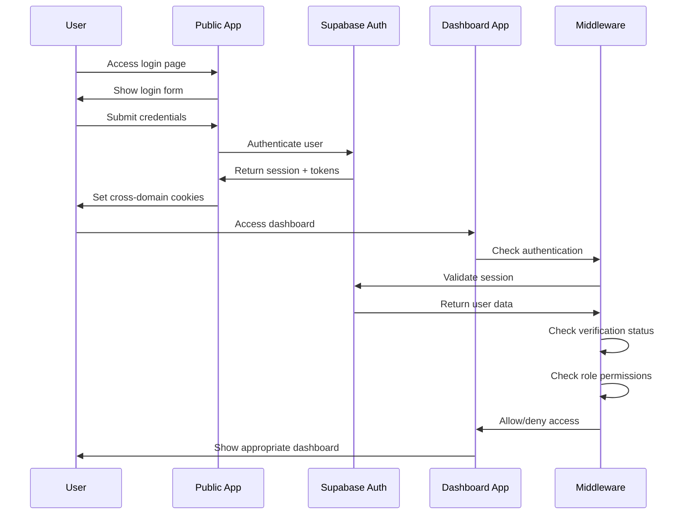

### Authorization Layers

1. **Middleware Level**: Route protection and role verification
2. **Database Level**: Row Level Security (RLS) policies
3. **Component Level**: UI element visibility based on permissions
4. **API Level**: Endpoint access control

### Cross-Domain Authentication

The platform implements sophisticated cross-domain authentication using shared cookies:

```typescript
// Shared cookie configuration
export const sharedCookieOptions: CookieConfig = {
  name: 'sb',
  domain: process.env.NODE_ENV === 'development' ? undefined : '.kitions.com',
  path: '/',
  maxAge: 60 * 60 * 24 * 7, // 7 days
  sameSite: 'lax',
  secure: process.env.NODE_ENV !== 'development',
  httpOnly: false, // Accessible to JavaScript for cross-domain functionality
};
```

### User Verification System

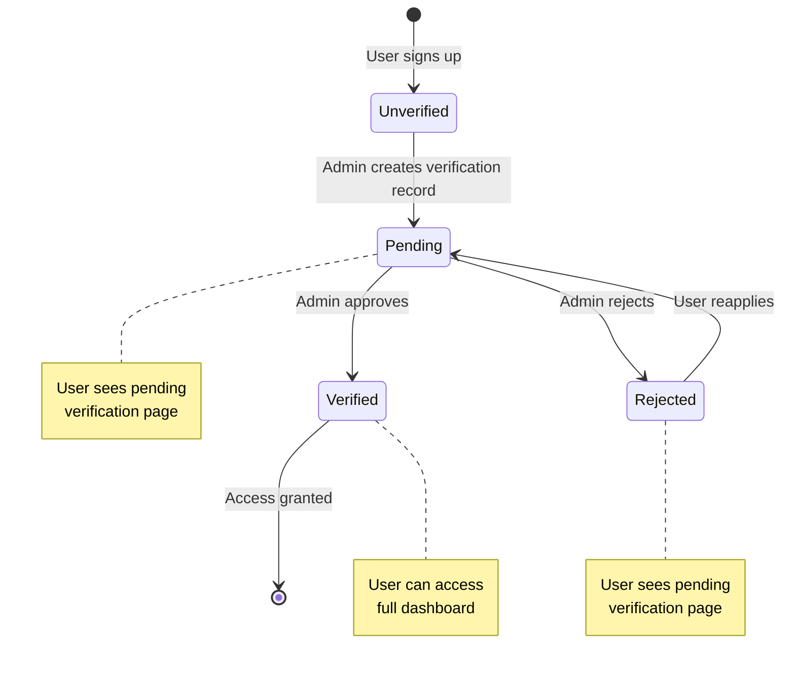

## Business Logic Analysis

### User Roles and Permissions

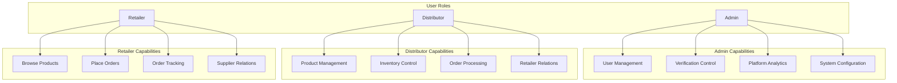

### Business Workflows

#### User Onboarding Workflow

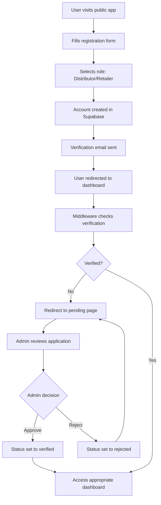

#### Order Processing Workflow

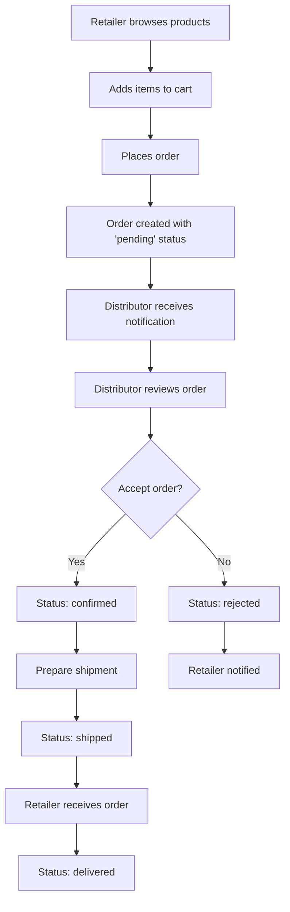

### Key Business Features

1. **Multi-tenant Architecture**: Separate data isolation for different user types
2. **Verification System**: Admin-controlled user approval process
3. **Product Catalog**: Distributor-managed product listings
4. **Order Management**: Complete order lifecycle tracking
5. **Inventory Control**: Real-time inventory management
6. **Barcode Integration**: Product identification and tracking
7. **File Management**: Document and image storage
8. **Reporting**: Business analytics and insights

## Security Implementation

### Security Layers

```mermaid
graph TB
    subgraph "Application Security"
        MW[Middleware Protection]
        RLS[Row Level Security]
        CORS[CORS Configuration]
        CSP[Content Security Policy]
    end
    
    subgraph "Authentication Security"
        JWT[JWT Tokens]
        COOKIE[Secure Cookies]
        SESSION[Session Management]
        MFA[Multi-Factor Ready]
    end
    
    subgraph "Data Security"
        ENCRYPT[Data Encryption]
        BACKUP[Automated Backups]
        AUDIT[Audit Logging]
        GDPR[GDPR Compliance]
    end
    
    MW --> RLS
    RLS --> CORS
    CORS --> CSP
    
    JWT --> COOKIE
    COOKIE --> SESSION
    SESSION --> MFA
    
    ENCRYPT --> BACKUP
    BACKUP --> AUDIT
    AUDIT --> GDPR
```

### Row Level Security (RLS) Policies

The platform implements comprehensive RLS policies:

```sql
-- Example: Users can only access their own data
CREATE POLICY "Users can read their own record" ON users
    FOR SELECT 
    USING (auth.uid() = id);

-- Example: Admins can access all user data
CREATE POLICY "Admins can read all users" ON users
    FOR SELECT 
    USING (
        EXISTS (
            SELECT 1 FROM users 
            WHERE id = auth.uid() 
            AND role = 'admin'
        )
    );
```

### Security Best Practices Implemented

1. **Environment Variable Validation**: Runtime validation of required environment variables
2. **Input Sanitization**: Proper validation and sanitization of user inputs
3. **SQL Injection Prevention**: Parameterized queries through Supabase client
4. **XSS Protection**: React's built-in XSS protection and CSP headers
5. **CSRF Protection**: SameSite cookie configuration
6. **Rate Limiting**: Supabase built-in rate limiting
7. **Secure Headers**: Security headers configuration

## Development Practices

### Code Organization

```
apps/
├── public-app/           # Customer-facing application
│   ├── app/             # Next.js App Router
│   │   ├── components/  # Reusable UI components
│   │   ├── utils/       # Utility functions
│   │   ├── lib/         # Library configurations
│   │   ├── hooks/       # Custom React hooks
│   │   └── api/         # API routes
│   ├── middleware.ts    # Authentication middleware
│   └── package.json     # Dependencies
├── dashboard-app/        # Business dashboard
│   ├── app/
│   │   ├── admin/       # Admin-specific pages
│   │   ├── distributor/ # Distributor dashboard
│   │   ├── retailer/    # Retailer dashboard
│   │   └── components/  # Shared components
│   └── middleware.ts    # Complex auth middleware
└── websites-app/         # Marketing site
    ├── app/
    │   ├── [locale]/    # Internationalized routes
    │   └── components/  # Marketing components
    ├── messages/        # Translation files
    └── middleware.ts    # Simple routing middleware
```

### Development Standards

1. **TypeScript**: Full type safety across all applications
2. **ESLint**: Code quality and consistency enforcement
3. **Component Architecture**: Modular, reusable component design
4. **Custom Hooks**: Shared business logic in custom hooks
5. **Error Boundaries**: Graceful error handling
6. **Loading States**: Comprehensive loading state management
7. **Responsive Design**: Mobile-first responsive design

### Testing Strategy

While not extensively implemented yet, the codebase is structured for:

1. **Unit Testing**: Component and utility function testing
2. **Integration Testing**: API endpoint testing
3. **E2E Testing**: User workflow testing
4. **Security Testing**: Authentication and authorization testing

## Performance Considerations

### Current Optimizations

1. **Turbopack**: Fast development builds
2. **Next.js Optimizations**: Automatic code splitting and optimization
3. **Image Optimization**: Next.js built-in image optimization
4. **Font Optimization**: Google Fonts optimization
5. **Bundle Analysis**: Webpack bundle analyzer integration ready

### Database Performance

1. **Indexed Queries**: Proper database indexing strategy
2. **Efficient Queries**: Selective field querying
3. **Connection Pooling**: Supabase connection pooling
4. **Caching Strategy**: Ready for Redis implementation

### Frontend Performance

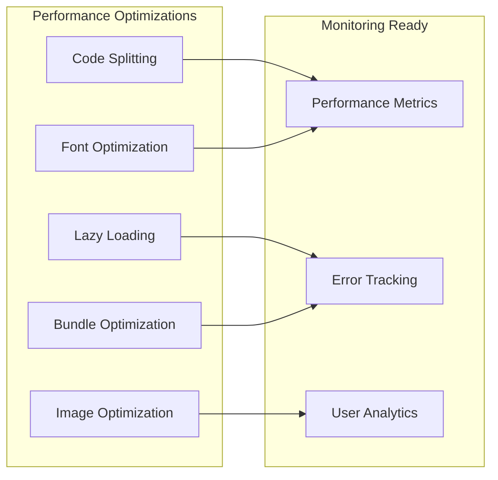

## Scalability Assessment

### Current Architecture Scalability

**Strengths**:
1. **Microservices-Ready**: Separate applications can scale independently
2. **Stateless Design**: Applications are stateless and horizontally scalable
3. **Database Scaling**: Supabase provides automatic scaling
4. **CDN Ready**: Static assets can be served via CDN
5. **Serverless Compatible**: Next.js applications are serverless-ready

**Potential Bottlenecks**:
1. **Single Database**: All applications share one Supabase instance
2. **Cross-Domain Cookies**: May complicate load balancing
3. **File Storage**: Supabase storage may need optimization for large files
4. **Real-time Features**: WebSocket connections may need optimization

### Scaling Recommendations

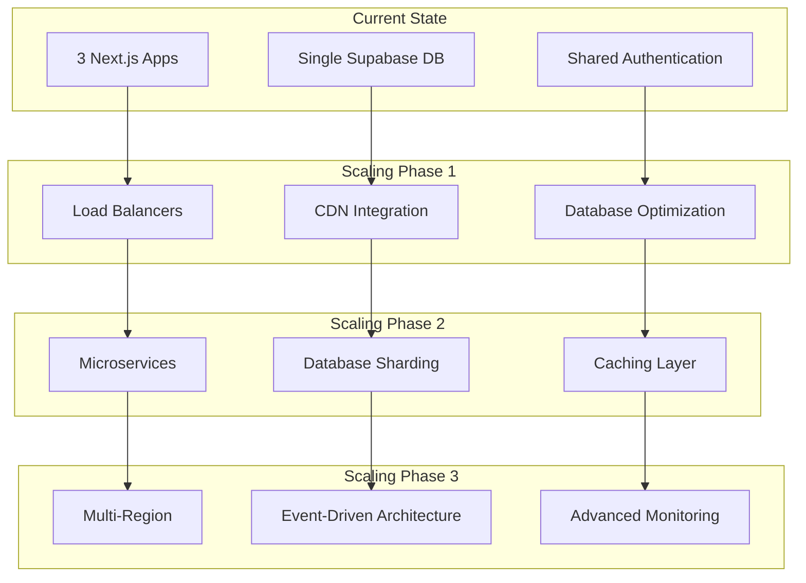

## Recommendations

### Immediate Improvements (0-3 months)

1. **Testing Implementation**
   - Add comprehensive unit tests for critical business logic
   - Implement integration tests for API endpoints
   - Set up E2E testing for user workflows

2. **Error Handling Enhancement**
   - Implement global error boundaries
   - Add structured logging with correlation IDs
   - Set up error monitoring (Sentry, LogRocket)

3. **Performance Monitoring**
   - Implement performance monitoring
   - Add database query optimization
   - Set up bundle size monitoring

4. **Security Hardening**
   - Implement Content Security Policy headers
   - Add rate limiting to API endpoints
   - Conduct security audit

### Medium-term Enhancements (3-6 months)

1. **Feature Completeness**
   - Complete all placeholder admin features
   - Implement advanced product management
   - Add comprehensive reporting and analytics

2. **User Experience**
   - Implement real-time notifications
   - Add progressive web app features
   - Enhance mobile responsiveness

3. **Developer Experience**
   - Set up CI/CD pipelines
   - Implement automated testing
   - Add code quality gates

4. **Scalability Preparation**
   - Implement caching strategies
   - Optimize database queries
   - Prepare for horizontal scaling

### Long-term Strategic Goals (6+ months)

1. **Platform Evolution**
   - Consider microservices architecture
   - Implement event-driven architecture
   - Add multi-tenant capabilities

2. **Advanced Features**
   - Machine learning for recommendations
   - Advanced analytics and reporting
   - Integration with external systems

3. **Global Expansion**
   - Multi-region deployment
   - Advanced internationalization
   - Compliance with regional regulations

### Technical Debt Management

1. **Code Quality**
   - Refactor complex middleware logic
   - Standardize error handling patterns
   - Improve component reusability

2. **Documentation**
   - Add comprehensive API documentation
   - Create developer onboarding guides
   - Document deployment procedures

3. **Monitoring & Observability**
   - Implement distributed tracing
   - Add business metrics tracking
   - Set up alerting systems

## Conclusion

The Kitions platform demonstrates a well-architected, modern web application ecosystem with strong foundations for growth. The use of Next.js 15, React 19, and Supabase provides a solid technical foundation, while the multi-application architecture allows for specialized functionality and independent scaling.

The platform's strengths lie in its comprehensive authentication system, role-based access control, and clean separation of concerns. The verification system and admin panel provide necessary business controls, while the internationalization support in the websites app shows consideration for global expansion.

Key areas for improvement include testing coverage, performance monitoring, and completion of placeholder features. The architecture is well-positioned for scaling, with clear paths for evolution from the current monolithic database approach to a more distributed system as the business grows.

Overall, the codebase reflects modern development practices and provides a strong foundation for a B2B marketplace platform with significant growth potential.

---

*This analysis was conducted on the Kitions platform codebase as of the current state. Recommendations should be prioritized based on business needs and available development resources.* 