# Kitions Platform - Technical Documentation

## Table of Contents
Here’s the setup:
- There’s a Supabase table called `user_verification_statuses` with columns: `user_id (uuid)`, `status (enum: 'pending', 'approved', 'rejected')`.
- When a user logs in and tries to access the dashboard app, I want to check their verification status.
- If their status is not 'approved', redirect them to `/pending-verification`.
- If approved, allow normal access (continue to protected pages).
- If there’s no session, redirect them to `/login`.
Here’s the setup:
- There’s a Supabase table called `user_verification_statuses` with columns: `user_id (uuid)`, `status (enum: 'pending', 'approved', 'rejected')`.
- When a user logs in and tries to access the dashboard app, I want to check their verification status.
- If their status is not 'approved', redirect them to `/pending-verification`.
- If approved, allow normal access (continue to protected pages).
- If there’s no session, redirect them to `/login`.

1. [Project Overview](#project-overview)
2. [Architecture Overview](#architecture-overview)
3. [Technology Stack](#technology-stack)
4. [Application Structure](#application-structure)
5. [Database Schema](#database-schema)
6. [Authentication & Authorization](#authentication--authorization)
7. [API Design](#api-design)
8. [Component Architecture](#component-architecture)
9. [State Management](#state-management)
10. [Deployment & Infrastructure](#deployment--infrastructure)
11. [Security Considerations](#security-considerations)
12. [Performance Optimizations](#performance-optimizations)
13. [Development Workflow](#development-workflow)

## Project Overview

Kitions is a comprehensive B2B platform that connects distributors and retailers in a streamlined marketplace. The platform consists of two main applications:

- **Public App** (`localhost:3000` / `kitions.com`): Marketing website with user registration and authentication
- **Dashboard App** (`localhost:3001` / `dashboard.kitions.com`): Business management interface for distributors and retailers

### Key Features

- **Multi-tenant Architecture**: Separate interfaces for distributors and retailers
- **Product Management**: Comprehensive inventory and catalog management
- **Order Management**: End-to-end order processing workflow
- **User Authentication**: Secure signup, login, and email verification
- **Real-time Updates**: Live inventory tracking and order status updates
- **Responsive Design**: Mobile-first approach with Tailwind CSS

## Architecture Overview

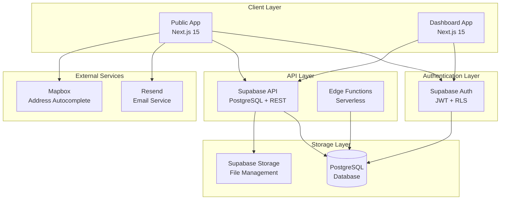

### Multi-Application Architecture

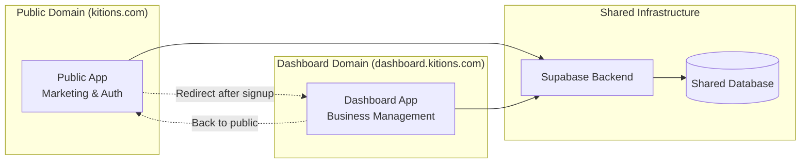

## Technology Stack

### Frontend Technologies

| Technology | Version | Purpose |
|------------|---------|---------|
| **Next.js** | 15.3.1 | React framework with SSR/SSG |
| **React** | 19.0.0 | UI library |
| **TypeScript** | 5.x | Type safety |
| **Tailwind CSS** | 4.x | Utility-first CSS framework |
| **Framer Motion** | 12.x | Animation library |
| **Lucide React** | 0.511.0 | Icon library |

### Backend & Database

| Technology | Purpose |
|------------|---------|
| **Supabase** | Backend-as-a-Service |
| **PostgreSQL** | Primary database |
| **Row Level Security** | Data access control |
| **Supabase Auth** | Authentication service |
| **Supabase Storage** | File storage |

### Development Tools

| Tool | Purpose |
|------|---------|
| **ESLint** | Code linting |
| **Turbopack** | Fast bundler (dev mode) |
| **PostCSS** | CSS processing |

### External Services

| Service | Purpose |
|---------|---------|
| **Resend** | Email delivery |
| **Mapbox** | Address autocomplete |
| **FontAwesome** | Additional icons |

## Application Structure

### Public App Structure

```
public-app/
├── app/
│   ├── (auth)/
│   │   ├── login/
│   │   ├── signup/
│   │   │   ├── role/
│   │   │   ├── complete-profile/
│   │   │   ├── verification/
│   │   │   └── success/
│   │   ├── forgot-password/
│   │   └── verification/
│   ├── auth/
│   │   └── confirm/
│   ├── api/
│   │   └── invite-user/
│   ├── components/
│   ├── providers/
│   ├── utils/
│   ├── hooks/
│   ├── lib/
│   └── config/
├── middleware.ts
└── package.json
```

### Dashboard App Structure

```
dashboard-app/
├── app/
│   ├── distributor/
│   │   ├── home/
│   │   ├── products/
│   │   ├── inventory/
│   │   ├── orders/
│   │   ├── reports/
│   │   └── settings/
│   ├── retailer/
│   │   ├── home/
│   │   └── settings/
│   ├── components/
│   │   ├── layout/
│   │   ├── products/
│   │   ├── orders/
│   │   ├── inventory/
│   │   ├── dashboard/
│   │   ├── barcode/
│   │   └── ui/
│   ├── providers/
│   ├── utils/
│   ├── hooks/
│   └── lib/
├── middleware.ts
└── package.json
```

## Database Schema

### Entity Relationship Diagram

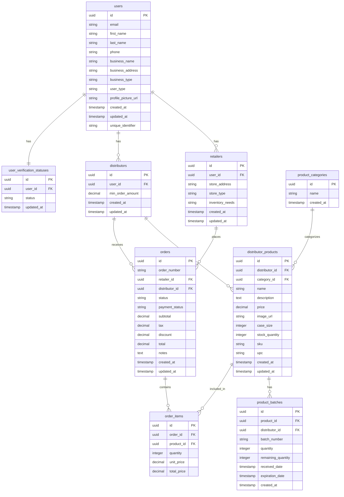

### Key Database Features

1. **Row Level Security (RLS)**: Implemented on all tables to ensure data isolation
2. **UUID Primary Keys**: For better security and distributed systems
3. **Audit Trails**: Created/updated timestamps on all entities
4. **Referential Integrity**: Foreign key constraints maintain data consistency
5. **Flexible Schema**: Supports multiple business types and use cases

## Authentication & Authorization

### Authentication Flow

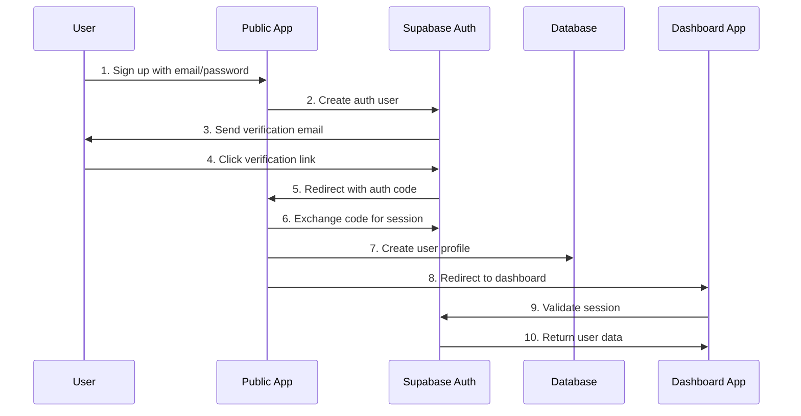

### Role-Based Access Control

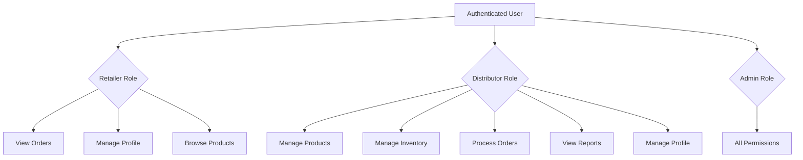

### Security Implementation

1. **JWT Tokens**: Secure session management
2. **Row Level Security**: Database-level access control
3. **HTTPS Only**: All communications encrypted
4. **CSRF Protection**: Built into Next.js
5. **Input Validation**: TypeScript + runtime validation
6. **Cookie Security**: HttpOnly, Secure, SameSite attributes

## API Design

### Supabase Integration Pattern

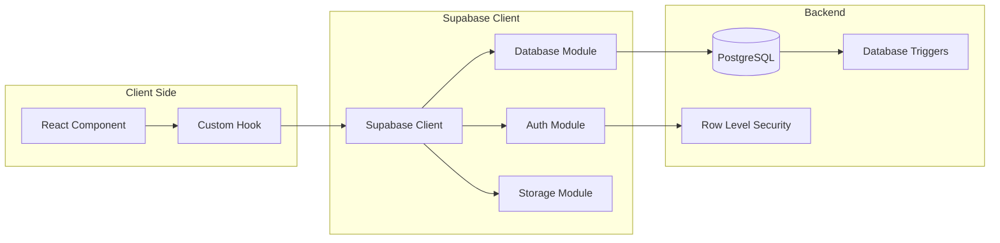

### Data Flow Patterns

#### Product Management Flow

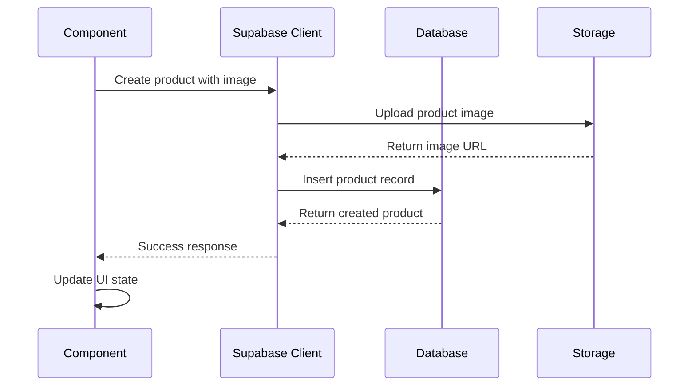

#### Order Processing Flow

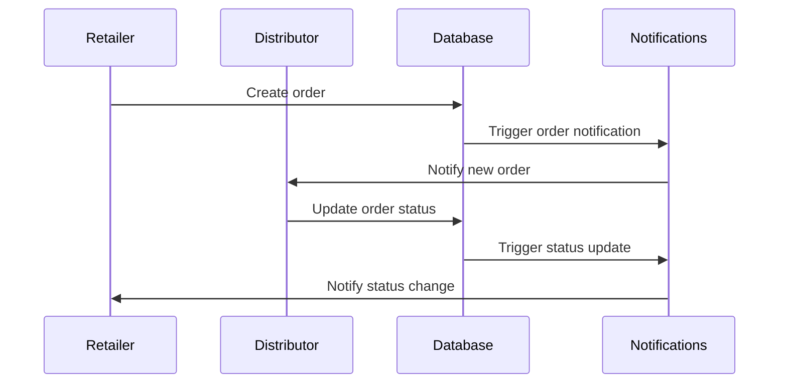

## Component Architecture

### Component Hierarchy

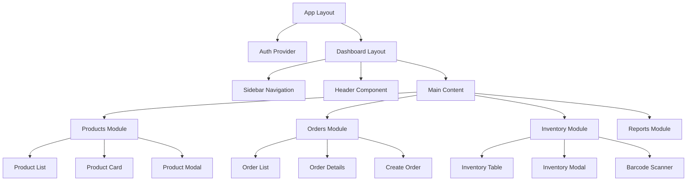

### Design Patterns

1. **Container/Presentational Pattern**: Separation of logic and UI
2. **Custom Hooks**: Reusable state logic
3. **Compound Components**: Complex UI components
4. **Render Props**: Flexible component composition
5. **Higher-Order Components**: Cross-cutting concerns

### Component Examples

#### Product Management Components

```typescript
// Product Card Component
interface ProductCardProps {
  product: Product;
  onEdit: (product: Product) => void;
  onDelete: (id: string) => void;
  onRefresh: () => void;
}

// Custom Hook for Product Management
function useProducts() {
  const [products, setProducts] = useState<Product[]>([]);
  const [loading, setLoading] = useState(true);
  
  const fetchProducts = useCallback(async () => {
    // Supabase integration logic
  }, []);
  
  return { products, loading, fetchProducts };
}
```

## State Management

### State Architecture

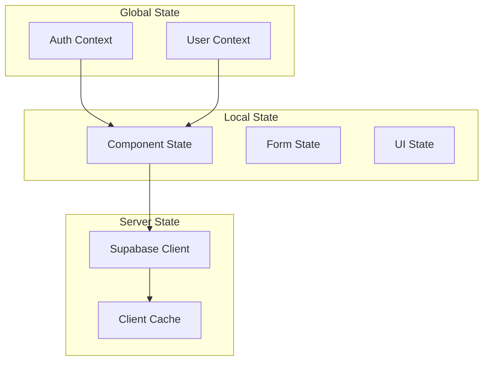

### State Management Patterns

1. **React Context**: Global authentication state
2. **useState/useReducer**: Local component state
3. **Custom Hooks**: Shared state logic
4. **Supabase Real-time**: Live data updates
5. **Session Storage**: Temporary data persistence

## Deployment & Infrastructure

### Deployment Architecture

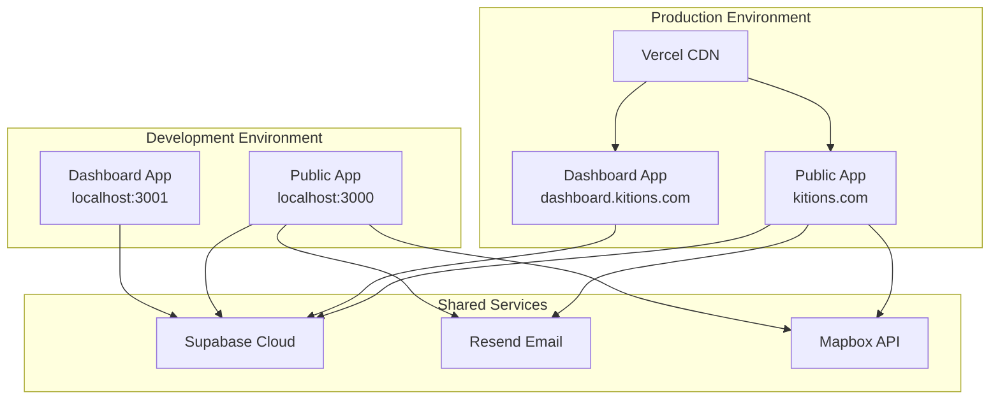

### Environment Configuration

| Environment | Public App URL | Dashboard App URL | Database |
|-------------|----------------|-------------------|----------|
| Development | localhost:3000 | localhost:3001 | Supabase Dev |
| Production | kitions.com | dashboard.kitions.com | Supabase Prod |

### Build & Deployment Process

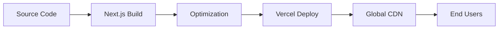

## Security Considerations

### Security Layers

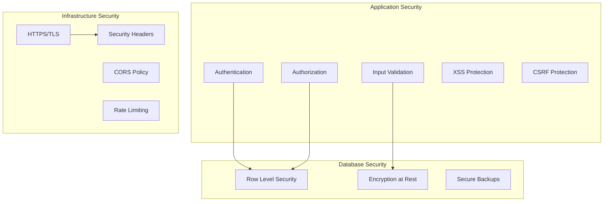

### Security Measures

1. **Authentication**: Supabase Auth with JWT tokens
2. **Authorization**: Role-based access control
3. **Data Protection**: Row Level Security policies
4. **Transport Security**: HTTPS everywhere
5. **Input Validation**: TypeScript + runtime checks
6. **File Upload Security**: Validated file types and sizes
7. **Session Management**: Secure cookie handling

## Performance Optimizations

### Frontend Optimizations

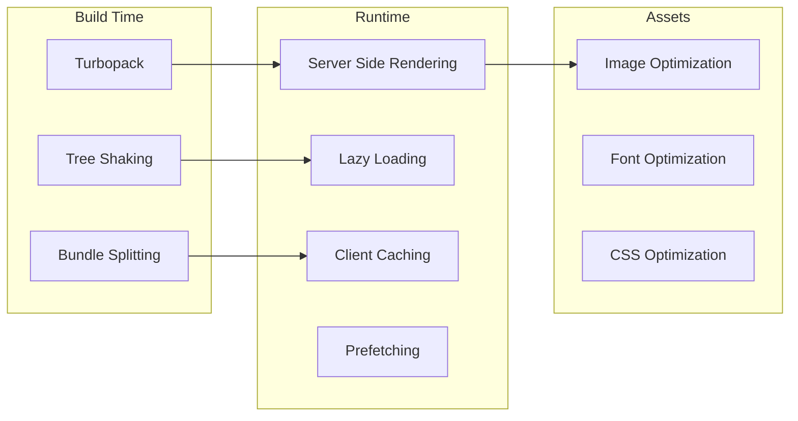

### Performance Features

1. **Next.js 15**: Latest performance improvements
2. **Turbopack**: Fast development builds
3. **Image Optimization**: Automatic WebP conversion
4. **Code Splitting**: Automatic route-based splitting
5. **Lazy Loading**: Component and route lazy loading
6. **Caching**: Aggressive caching strategies
7. **CDN**: Global content delivery

### Database Optimizations

1. **Indexing**: Strategic database indexes
2. **Query Optimization**: Efficient Supabase queries
3. **Connection Pooling**: Managed by Supabase
4. **Real-time Subscriptions**: Efficient data updates

## Development Workflow

### Development Process

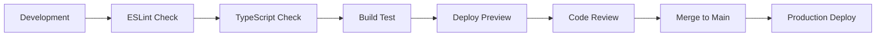

### Code Quality

1. **TypeScript**: Strict type checking
2. **ESLint**: Code linting and formatting
3. **Prettier**: Code formatting (via ESLint)
4. **Husky**: Git hooks for quality checks
5. **Conventional Commits**: Standardized commit messages

### Testing Strategy

1. **Unit Tests**: Component and utility testing
2. **Integration Tests**: API and database testing
3. **E2E Tests**: Full user journey testing
4. **Manual Testing**: User acceptance testing

### Development Commands

```bash
# Public App
cd public-app
npm run dev          # Development server (port 3000)
npm run build        # Production build
npm run lint         # ESLint check

# Dashboard App
cd dashboard-app
npm run dev          # Development server (port 3001)
npm run build        # Production build
npm run lint         # ESLint check
```

## Key Technical Decisions

### Architecture Decisions

1. **Multi-App Architecture**: Separate concerns and domains
2. **Supabase Backend**: Rapid development with built-in features
3. **Next.js 15**: Latest React features and performance
4. **TypeScript**: Type safety and developer experience
5. **Tailwind CSS**: Utility-first styling approach

### Database Decisions

1. **PostgreSQL**: Robust relational database
2. **UUID Primary Keys**: Better security and distribution
3. **Row Level Security**: Database-level authorization
4. **Audit Trails**: Comprehensive change tracking

### Frontend Decisions

1. **Server Components**: Better performance and SEO
2. **Client Components**: Interactive user interfaces
3. **Custom Hooks**: Reusable state logic
4. **Component Libraries**: Consistent UI patterns

## Future Enhancements

### Planned Features

1. **Real-time Chat**: Communication between distributors and retailers
2. **Advanced Analytics**: Business intelligence dashboard
3. **Mobile Apps**: Native iOS and Android applications
4. **API Gateway**: Public API for third-party integrations
5. **Multi-language Support**: Internationalization
6. **Advanced Search**: Elasticsearch integration
7. **Payment Processing**: Integrated payment solutions

### Technical Improvements

1. **Microservices**: Break down into smaller services
2. **Event Sourcing**: Better audit trails and state management
3. **GraphQL**: More efficient data fetching
4. **Redis Caching**: Improved performance
5. **Monitoring**: Application performance monitoring
6. **CI/CD Pipeline**: Automated testing and deployment

---

*This documentation is maintained by the development team and updated with each major release.* 